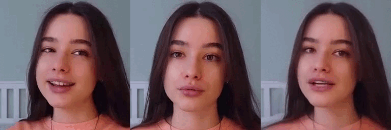

# Jittor version: First Order Motion Model for Image Animation

**First Order Motion Model for Image Animation**  
Aliaksandr Siarohin, Stéphane Lathuilière, Sergey Tulyakov, Elisa Ricci and Nicu Sebe. In [NeurIPS](https://papers.nips.cc/paper/2019/hash/31c0b36aef265d9221af80872ceb62f9-Abstract.html), 2019.

<p align="center">

</p>

The original page: [[Project Page]](https://github.com/AliaksandrSiarohin/first-order-model)

## Notes
We implement the Vox model for facial videos and images. The official weight are converted to jittor. Download the weight and put it in `./weights/`

The Google Drive link: https://drive.google.com/drive/folders/1pMODD4H_pb_9-YAFDXkv8W59mRzqxW2_?usp=sharing

## Quick start

Reconstruct a video with single image : <br>
```
python demo.py --source_image exp/img.jpg --driving_video exp/ori.mp4 --result_video exp/recon.mp4 --find_best_frame
```
<p align="center">

</p>

Drive a single image with relative mode: <br>

```
python demo.py --source_image exp/frame00043.jpg --driving_video exp/ori.mp4 --result_video exp/relative.mp4 --relative --find_best_frame
```
<p align="center">

</p>

Drive a single image with absolute mode: <br>

```
python demo.py --source_image exp/frame00043.jpg --driving_video exp/ori.mp4 --result_video exp/relative.mp4 --find_best_frame
```
<p align="center">

</p>


## Acknowledgements

This repository borrows partially from the [original codes](https://github.com/AliaksandrSiarohin/first-order-model). 
